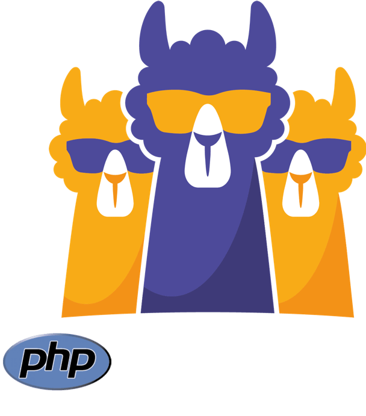
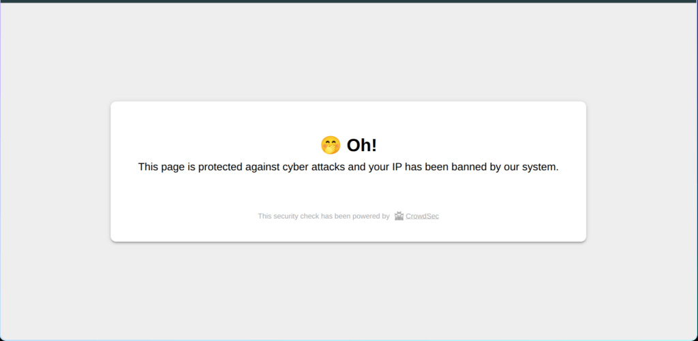
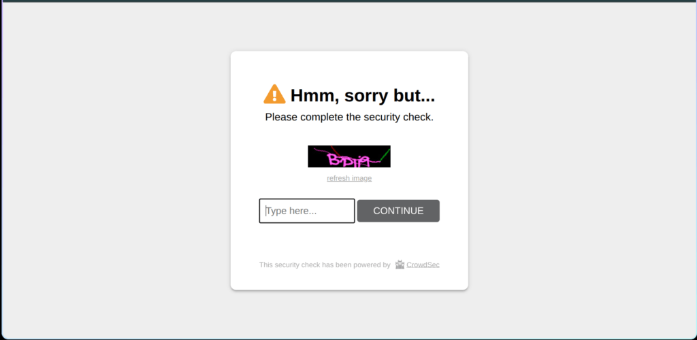

This is a translation of the original article published in French on [Aukfood's Blog](https://www.aukfood.fr/devenez-le-gandalf-de-votre-serveur-lamp-you-shall-not-pass/).
&nbsp;

---

&nbsp;
In this article, we will address the theme of **Web Application Firewall (WAF)**. But why implement a WAF? Simply to protect your LAMP stack (Linux, Apache, MySQL, PHP) against the numerous threats that target online applications daily.

A website exposed on the Internet is susceptible to being attacked in multiple ways: SQL injections, cross-site scripting (XSS) attempts, brute force attacks, exploitation of known vulnerabilities in PHP or Apache, not to mention automated bots that constantly scan vulnerable servers. A WAF acts as an intelligent barrier between your visitors and your application, capable of identifying and blocking these attacks before they reach your server.

With a WAF, you become a true Gandalf of the web, raising your shield against attacks of all kinds. Like the famous wizard who declares "You shall not pass!", your web application firewall prevents malicious intruders from crossing the threshold of your infrastructure.

It's a bit like in a heavy metal music video: the WAF is your steel sink, resistant to all digital splashes and torrents of attacks that crash against it. Malicious robots, SQL injections, or bizarre requests? They bounce off it like poorly washed dishes. In the end, your LAMP stack remains clean and operational, while your WAF plays the role of the unsung hero, absorbing chaos with "metal" power worthy of its name.

&nbsp;

---

&nbsp;
<h3>
Open-source WAF?
</h3>

Opting for an open-source WAF means choosing a solution that is **economical**, **flexible**, and **transparent**. No expensive licensing, completely customizable configuration to your needs, and especially open code that anyone can audit to guarantee its reliability. Finally, the support of an active community allows you to benefit from constant improvements and already proven rules. In short: more control, more confidence, fewer constraints.
&nbsp;

---

&nbsp;
<h3>
Chosen Solutions
</h3>

To **effectively secure your LAMP stack**, we will combine two complementary approaches: **collaborative detection and prevention** with CrowdSec and **classic application protection** with ModSecurity.
&nbsp;

<h4>
CrowdSec AppSec
</h4>

CrowdSec is an open-source collaborative security solution. Its objective is to **analyze traffic in real-time**, identify malicious behaviors, and make blocking decisions. With its **AppSec** component, CrowdSec offers a **variety of WAF security rules** ready to use, adapted to web applications.
&nbsp;

<h4>
PHP Bouncer
</h4>

To apply these AppSec rules, we will configure a **bouncer**, that is, a module responsible for remedying attacks by blocking malicious requests. We will use the **PHP** bouncer, which integrates perfectly with Apache/PHP. There is also a bouncer for Apache (or NGINX), but these versions are still recent and in development, making the PHP bouncer more stable and reliable for our stack.
Additionally, the PHP bouncer will give us the ability to implement a captcha.
&nbsp;

<h4>
ModSecurity
</h4>

ModSecurity is a **historic and widely recognized WAF** in the open-source world. It functions as an Apache module, capable of analyzing each HTTP request according to predefined rules, notably the famous **OWASP Core Rules**. Its strength lies in its maturity and flexibility: it can block a large number of common attacks and be finely tuned according to the specific needs of your application.
&nbsp;

---

&nbsp;
<h3>
Prerequisites
</h3>

Before deploying CrowdSec, its PHP bouncer, and ModSecurity, make sure you have a server ready to host your configuration. Here's what it should contain:

- One of your preferred servers, with:
	- A Debian distribution
	- A LAMP stack installed
	- CrowdSec already installed and operational (v0.6.11)
&nbsp;

---

&nbsp;
<h3>
Installation and Configuration
</h3>

We can now begin the installation of the different solutions listed previously.
&nbsp;

<h4>
AppSec
</h4>


1. Installing collections
```bash
cscli collections install crowdsecurity/appsec-default crowdsecurity/appsec-crs crowdsecurity/appsec-generic-rules crowdsecurity/appsec-virtual-patching
```

2. Setting up the acquis

<div style="margin-left: 35px;">
<pre><code class="language-bash">mkdir -p /etc/crowdsec/acquis.d
cat > /etc/crowdsec/acquis.d/appsec.yaml << 'EOF'
listen_addr: 127.0.0.1:7422
appsec_configs:
  - crowdsecurity/appsec-default
name: myAppSecComponent
source: appsec
labels:
  type: appsec
EOF
</code></pre>
</div>

3. Restart CrowdSec
```bash
systemctl restart crowdsec
```

4. Verify proper functioning
```bash
ss -tulnp | grep 7422
```
&nbsp;

<h4>
PHP Bouncer
</h4>


&nbsp;

<h5>
Prerequisites
</h5>

1. Updated system
```bash
sudo apt update && sudo apt upgrade -y
```

2. Installing various dependencies
```bash
sudo apt install -y php-cli php-curl php-gd php-json php-mbstring php-xml php-zip git
```
```bash
php -v
```

3. Installing Composer
```bash
cd ~
php -r "copy('https://getcomposer.org/installer', 'composer-setup.php');"
php composer-setup.php --install-dir=/usr/local/bin --filename=composer
rm composer-setup.php
```
```bash
composer --version
```
&nbsp;

<h5>
Setting up the PHP bouncer
</h5>

1. Creating the directory
```bash
sudo mkdir -p /var/www/crowdsec-standalone-bouncer
sudo chown -R $(whoami):$(whoami) /var/www/crowdsec-standalone-bouncer
```

2. Setting up the bouncer via Composer
```bash
composer create-project crowdsec/standalone-bouncer /var/www/crowdsec-standalone-bouncer --keep-vcs
```

- [] Note: We must keep the vcs data as we will use it to update the bouncer when a new version is available.

3. Setting up permissions
```bash
sudo chown -R www-data /var/www/crowdsec-standalone-bouncer
sudo chmod g+w /var/www/crowdsec-standalone-bouncer
```

4. Setting up settings.php
```bash
cp scripts/settings.php.dist scripts/settings.php
```

5. Setting up the API_KEY
```bash
API_KEY=$(sudo cscli bouncers add standalone-bouncer -o raw) \
&& sed -i "s/'api_key' => 'YOUR_BOUNCER_API_KEY'/'api_key' => '$API_KEY'/" scripts/settings.php \
&& unset API_KEY
```

6. Setup captcha expiration
```bash
sed -i "s/'captcha_cache_duration' => Constants::CACHE_EXPIRATION_FOR_CAPTCHA,/'captcha_cache_duration' => 3600,/" scripts/settings.php
```
By default, when a user successfully completes the captcha, for 24 hours, even if a scenario is triggered by their IP address, the bouncer will consider the captcha already solved.
This prevents the user from having to redo it too often.
In this example, we chose to reduce this duration to 1 hour.

7. Enable AppSec
```bash
sed -i "s/'use_appsec' => false/'use_appsec' => true/" scripts/settings.php
```
So that the bouncer can use the AppSec rules installed previously

8. To setup in the `.htaccess` of different sites
```bash
php_value auto_prepend_file "/var/www/crowdsec-standalone-bouncer/scripts/bounce.php"
```
You can also add this line to the `.ini` file.
```bash
auto_prepend_file = /var/www/crowdsec-standalone-bouncer/scripts/bounce.php
```
&nbsp;

<h5>
CrowdSec Part
</h5>

1. To add in the CrowdSec iptables bouncer
```bash
scenarios_not_containing: ["http", "modsecurity", "appsec"]
```
This step is important: if we want only the PHP bouncer to handle HTTP requests, we must tell CrowdSec/iptables not to take into account HTTP scenarios from ModSecurity and AppSec.

2. Add the captcha part to the CrowdSec profile

<div style="margin-left: 35px;">
<pre><code class="language-bash">name: crawler_captcha_remediation
filters:
  - Alert.Remediation == true && Alert.GetScope() == "Ip" && Alert.GetScenario() in ["crowdsecurity/http-crawl-non_statics", "crowdsecurity/http-bad-user-agent"]
decisions:
  - type: captcha
    duration: 1h
on_success: break
</code></pre>
</div>

3. Install the modsecurity collection
```bash
cscli collection install crowdsecurity/modsecurity
```
&nbsp;

<h4>
ModSecurity
</h4>


1. Install ModSecurity
```bash
sudo apt update
sudo apt install libapache2-mod-security2
```

2. Enable the module
```bash
sudo a2enmod security2
sudo systemctl restart apache2
```

3. Apply the configuration
```bash
sudo cp /etc/modsecurity/modsecurity.conf-recommended /etc/modsecurity/modsecurity.conf
```

4. Check this file `/etc/apache2/mods-enabled/security2.conf`
```bash
<IfModule security2_module>
	# Default Debian dir for modsecurity's persistent data
	SecDataDir /var/cache/modsecurity

	# Include all the *.conf files in /etc/modsecurity.
	# Keeping your local configuration in that directory
	# will allow for an easy upgrade of THIS file and
	# make your life easier
        IncludeOptional /etc/modsecurity/*.conf

	# Include OWASP ModSecurity CRS rules if installed
	IncludeOptional /usr/share/modsecurity-crs/*.load
</IfModule>
```

5. Verify that the module has been loaded properly
```bash
apachectl -M | grep security2
```
&nbsp;

---

&nbsp;
<h3>
Testing & Validation
</h3>

Once CrowdSec, its PHP bouncer, and ModSecurity are installed, we must verify that our protection works correctly. The objective is to ensure that common attacks are properly detected and blocked.
&nbsp;

<h4>
Basic Verification
</h4>

We access our site normally from a browser to confirm that legitimate traffic is not blocked.
We can also check Apache, CrowdSec, and ModSecurity logs to verify that everything is working correctly.
&nbsp;

<h4>
Simple Attack Simulation
</h4>

We can test some classic attacks to validate the proper functioning of the WAF:

- SQL Injection:
```bash
curl "https://ourpenguinsite.com/index.php?id=1' OR '1'='1"
# or: curl -G "https://ourpenguinsite.com/index.php" --data-urlencode "id=1' OR '1'='1"
```
We can see that we indeed trigger an alert from ModSecurity following an SQLi attack:
```bash
╭─────────┬──────────┬──────────────────┬───────────────────────────────────┬─────────┬─────────┬──────────────────────────────────┬────────┬────────────┬──────────╮
│    ID   │  Source  │    Scope:Value   │               Reason              │  Action │ Country │                AS                │ Events │ expiration │ Alert ID │
├─────────┼──────────┼──────────────────┼───────────────────────────────────┼─────────┼─────────┼──────────────────────────────────┼────────┼────────────┼──────────┤
│ 6050427 │ crowdsec │ Ip:11.22.33.111  │ crowdsecurity/modsecurity-sqli    │ ban     │ FR      │ 3215 MonAS                       │ 1      │ 3h59m53s   │ 1606     │
```


- XSS Injection:
```bash
curl "https://ourpenguinsite.com/index.php?q=<script>alert('XSS')</script>"
```
Once again, we can see the scenario trigger
```bash
╭─────────┬──────────┬──────────────────┬───────────────────────────────────┬─────────┬─────────┬──────────────────────────────────┬────────┬────────────┬──────────╮
│    ID   │  Source  │    Scope:Value   │               Reason              │  Action │ Country │                AS                │ Events │ expiration │ Alert ID │
├─────────┼──────────┼──────────────────┼───────────────────────────────────┼─────────┼─────────┼──────────────────────────────────┼────────┼────────────┼──────────┤
│ 6050430 │ crowdsec │ Ip:11.22.33.111  │ crowdsecurity/modsecurity-xss     │ ban     │ FR      │ 3215 MonAS                       │ 1      │ 3h59m59s   │ 1612     │
```

- vpatch-CVE-2017-9841:
```bash
curl "https://ourpenguinsite.com/util/php/eval-stdin.php"
```
We can now see that we triggered a specific rule present in AppSec, which corresponds to CVE-2017-9841, the PHPUnit RCE vulnerability
```bash
╭─────────┬──────────┬──────────────────┬───────────────────────────────────┬─────────┬─────────┬──────────────────────────────────┬────────┬────────────┬──────────╮
│    ID   │  Source  │    Scope:Value   │               Reason              │  Action │ Country │                AS                │ Events │ expiration │ Alert ID │
├─────────┼──────────┼──────────────────┼───────────────────────────────────┼─────────┼─────────┼──────────────────────────────────┼────────┼────────────┼──────────┤
│ 6050431 │ crowdsec │ Ip:11.22.33.111  │ crowdsecurity/CVE-2017-9841       │ ban     │ FR      │ 3215 MonAS                       │ 1      │ 3h59m57s   │ 1613     │
```
&nbsp;

<h4>
Captcha with the PHP bouncer
</h4>

```bash
curl -A "Nikto" "https://ourpenguinsite.com/"
```
And now, we can see that if we trigger a rule that itself activates a CAPTCHA, we get the desired result. Useful when a legitimate person finds themselves blocked:
```bash
╭─────────┬──────────┬──────────────────┬───────────────────────────────────┬─────────┬─────────┬──────────────────────────────────┬────────┬────────────┬──────────╮
│    ID   │  Source  │    Scope:Value   │               Reason              │  Action │ Country │                AS                │ Events │ expiration │ Alert ID │
├─────────┼──────────┼──────────────────┼───────────────────────────────────┼─────────┼─────────┼──────────────────────────────────┼────────┼────────────┼──────────┤
│ 6050433 │ crowdsec │ Ip:11.22.33.111  │ crowdsecurity/http-bad-user-agent │ captcha │ FR      │ 3215 MonAS                       │ 2      │ 59m50s     │ 1615     │
```



&nbsp;

---

&nbsp;
<h3>
Optimization & Best Practices
</h3>

Once our protections are in place, we must ensure that our LAMP stack remains both secure and functional. Here are the key points:

1. Adjust rules according to our site
	- CrowdSec and ModSecurity come with default rules, but some may block legitimate traffic.
	- We must analyze logs and adjust scenarios to reduce false positives without compromising security.

2. Update regularly
	- Threats evolve constantly. We must maintain CrowdSec, its scenarios, its PHP bouncer, and ModSecurity up to date to stay protected.

3. Monitoring and tracking
	- We can regularly check logs (`/var/log/crowdsec.log`, `/var/log/apache2/modsec_audit.log`) to detect suspicious behaviors and verify the effectiveness of rules.
	- Tools like `cscli` for CrowdSec allow getting a quick summary of blocking decisions and detected activity.

4. Test before production
	- Any modification of rules or addition of new scenarios must be tested in a pre-production environment or in simulation mode, which is very easily configurable.

5. Take advantage of the community
	- CrowdSec and ModSecurity benefit from an active community. We can share our scenarios and benefit from updates and feedback to improve our configuration.

By applying these best practices, we ensure that our dual CrowdSec + ModSecurity protection remains effective, reliable, and adapted to our environment.
&nbsp;

---

&nbsp;
<h3>
Conclusion
</h3>

By combining CrowdSec, its PHP bouncer, and ModSecurity, we have implemented a robust double layer of defense for our LAMP stack. On one side, CrowdSec detects and blocks malicious behaviors in a collaborative and adaptive manner; on the other, ModSecurity filters HTTP requests according to proven rules.

Thanks to this configuration, we become a bit like the Gandalf of the web: we prevent attacks from breaching our servers while allowing legitimate traffic to pass. With the PHP bouncer, we can even integrate additional measures like captcha to strengthen protection.

Finally, by following best practices - regular updates, rule adjustments, log monitoring, and testing - we guarantee that our WAF remains effective, reliable, and scalable against threats that never stop evolving.

In summary, a well-configured open-source WAF doesn't just protect our site: it offers us control, transparency, and peace of mind to manage our web infrastructure with confidence.
&nbsp;

---

&nbsp;
<h3>
Troubleshooting
</h3>

- PHP FPM
	- Make sure to specify the bouncer directory in the opendir of php.conf.
	- Check the php dependencies in composer.lock
&nbsp;

---

&nbsp;
<h3>
References
</h3>

- [PHP Standalone Bouncer](https://docs.crowdsec.net/u/bouncers/php/)
- [ModSecurity Project](https://modsecurity.org/)
