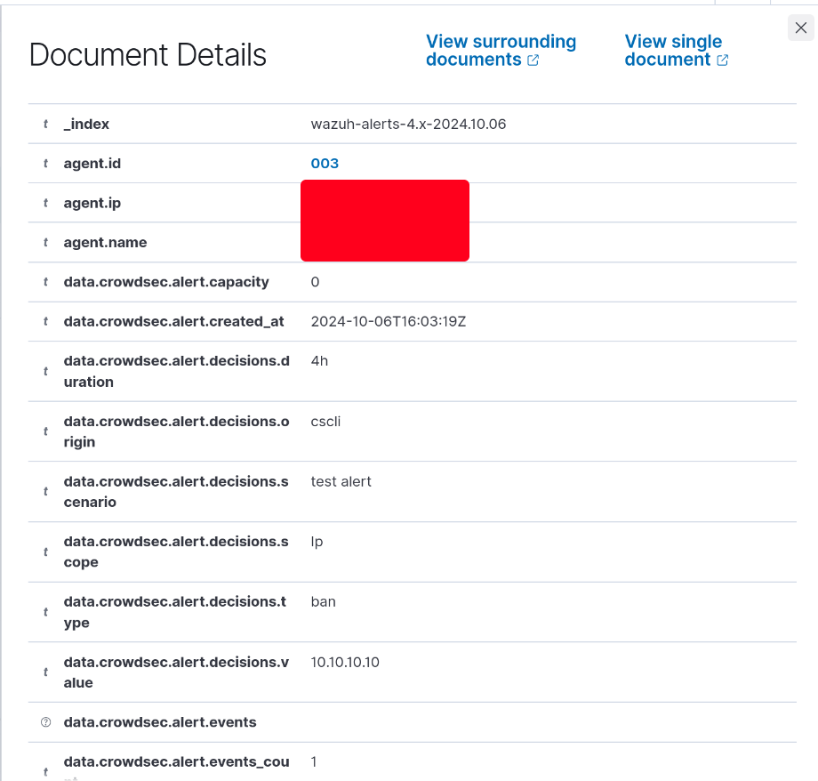
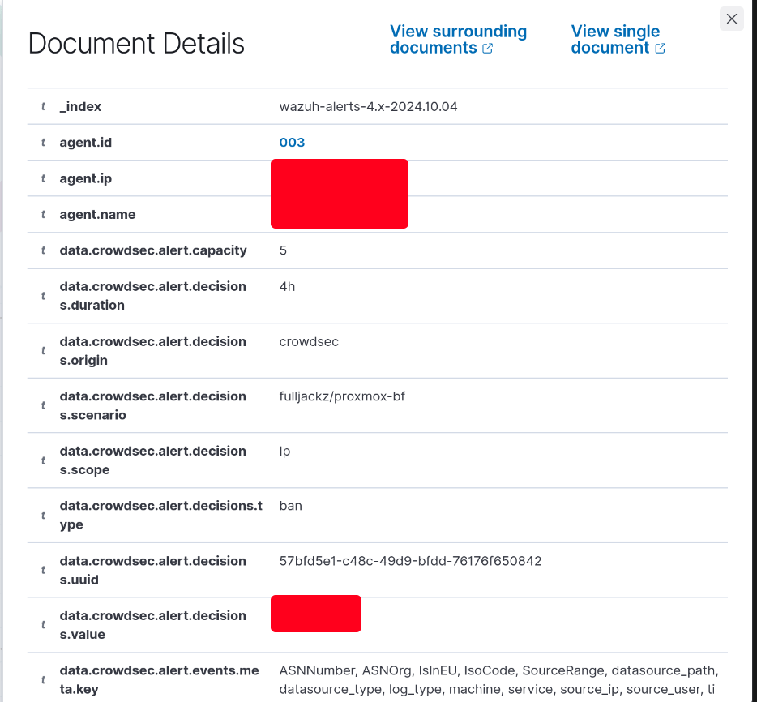

# Crowdsec x Wazuh

This is a translation of the [original article](https://www.aukfood.fr/wazuh-x-crowdsec/) published in French on Aukfood's Blog.

Discover today the integration of CrowdSec with Wazuh.

This integration aims to centralize CrowdSec alerts into a SIEM. In our example, I will use Wazuh to demonstrate the power of open-source.

### Prerequisites
- Crowdsec >= v1.6.3
- Wazuh >= v4.9.0

### CrowdSec Configuration
Let's start by creating the `wazuh.yaml` file, a file that will contain the notification for sending CrowdSec alerts to the temporary file `crowdsec_alerts.json`. Choosing a JSON file allows for better interpretation by Wazuh, which eliminates the need to create a decoder.

`/etc/crowdsec/notifications/file.yaml`
```yaml
# Do not change
type: file

name: wazuh # Name of the plugin to register in profiles.yaml
log_level: info

# This template renders all events in ndjson format
format: |
  {{range . -}}
   { "crowdsec": { "time": "", "program": "crowdsec", "alert": {{. | toJson }} }}
  {{ end -}}

# group_wait:
# group_threshold:

log_path: "/tmp/crowdsec_alerts.json" # or %TEMP%\crowdsec_alerts.json
rotate:
  enabled: true 
  max_size: 500 # in MB
  max_files: 5
  max_age: 5
  compress: true
```

All that’s left is to add the plugin to the profiles.yaml file, then restart the CrowdSec configuration.

`/etc/crowdsec/profiles.yaml`
```yaml
name: default_ip_remediation
#debug: true
filters:
 - Alert.Remediation == true && Alert.GetScope() == "Ip"
decisions:
 - type: ban
   duration: 4h
#duration_expr: Sprintf('%dh', (GetDecisionsCount(Alert.GetValue()) + 1) * 4)
notifications:
    - wazuh # <- /etc/crowdsec/notifications/wazuh.yaml or /etc/crowdsec/notifications/file.yaml
#   - slack_default  # Set the webhook in /etc/crowdsec/notifications/slack.yaml before enabling this.
#   - splunk_default # Set the splunk url and token in /etc/crowdsec/notifications/splunk.yaml before enabling this.
#   - http_default   # Set the required http parameters in /etc/crowdsec/notifications/http.yaml before enabling this.
#   - email_default  # Set the required email parameters in /etc/crowdsec/notifications/email.yaml before enabling this.
on_success: break
```
```bash
sudo systemctl reload crowdsec
```

Now that the CrowdSec part is complete, all that's left is to configure Wazuh.

It is preferable to use centralized management rather than a local configuration. Therefore, creating a group in Wazuh is necessary, and the name will be `Crowdsec`. Then, you need to edit the group's configuration to be able to read the `/tmp/crowdsec_alerts.json` file on our clients.

`/var/ossec/etc/shared/Crowdsec/agent.conf`
```xml
<agent_config>
    <localfile>
        <location>/tmp/crowdsec_alerts.json</location>
        <log_format>json</log_format>
        <only-future-events>no</only-future-events>
    </localfile>
</agent_config>
```

Next, you need to create a rules file in order to trigger Wazuh alerts. Otherwise, the CrowdSec alerts will be useless. Two rules will be created: one for level 12 alerts and another for test alerts.

`/var/ossec/etc/rules/crowdsec-rules.xml`
```xml
<group name="crowdsec,">
    <!-- Nous considérerons que toutes les alertes CrowdSec sont importantes. -->
    <rule id="100002" level="12">
        <decoded_as>json</decoded_as>
        <field name="crowdsec.program">crowdsec</field>
        <description>CrowdSec alert: $(crowdsec.alert.message)</description>
    </rule>

    <rule id="100003" level="3">
        <if_sid>100002</if_sid>
        <field name="crowdsec.alert.message">test alert</field>
        <description>Test alert for CrowdSec.</description>
    </rule>
</group>
```
You can also add the rules from this You can also add the rules from this [GitHub repo](https://github.com/aukfood/wazuh-rules-crowdsec-mitre/blob/main/crowdsec.xml). These are more advanced and customized rules, including filtering for MITRE.

The configuration is now complete. All that's left is to test it. We can start by testing the level 3 rule, which corresponds to the test rule. We can use the following command directly on the client machine: `cscli notifications test file_default`.

We can see that the test rule is triggered correctly, including the various information from **data.crowdsec.alert**.

We can now try the level 12 rule. We tested this on our Proxmox server, but it works with any type of server and CrowdSec alerts.

The CrowdSec alert **fulljackz/proxmox-bf** appears in Wazuh, and thus the level 12 rule is triggered.

### To conclude

The integration is simple and very effective. It strengthens centralized management of CrowdSec alerts in a SIEM.

