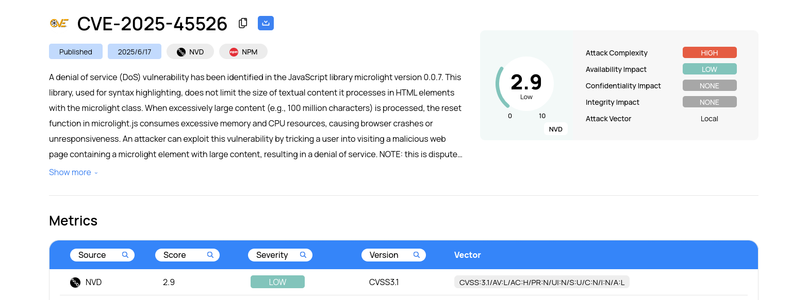

<!-- Wazuh CTI : Une nouvelle ère pour la Threat Intelligence -->

<h1>Wazuh CTI : Une nouvelle ère pour la Threat Intelligence</h1>

  

Wazuh, déjà reconnu pour ses solutions de sécurité open source, franchit une nouvelle étape avec l’introduction de son service Cyber Threat Intelligence (CTI). Cette plateforme vise à fournir aux organisations des informations actualisées, fiables et exploitables sur les menaces et vulnérabilités émergentes.

  
  
<em>Exemple d’affichage d’une vulnérabilité (CVE) sur la plateforme Wazuh CTI</em>

<h2>Qu’est-ce que Wazuh CTI ?</h2>

Le service CTI de Wazuh est une plateforme publique qui collecte, analyse et diffuse des renseignements sur les cybermenaces. Son objectif principal est d’aider les entreprises à réduire leur surface d’attaque et à minimiser les risques d’exploitation et de fuite de données.

Lancé avec la version 4.12.0 de Wazuh, le CTI se concentre d’abord sur l’intelligence des vulnérabilités, offrant des mises à jour régulières sur les CVE (Common Vulnerabilities and Exposures), les scores de sévérité, les informations sur l’exploitabilité et les stratégies de mitigation.

<a href="https://wazuh.com/blog/introducing-wazuh-cti/" target="_blank">Découvrir Wazuh CTI</a>

<h2>Sources de données fiables</h2>

Pour garantir la qualité et la pertinence de ses informations, Wazuh CTI agrège et normalise les données provenant de sources reconnues :

<ul>
  <li><strong>Vendeurs de systèmes d’exploitation</strong> : AlmaLinux, Amazon Linux, ArchLinux, Ubuntu, Debian, Fedora, Oracle Linux, Red Hat, Rocky Linux, SUSE Linux Enterprise…</li>
  <li><strong>Bases de données de sécurité</strong> : Microsoft Security Updates (MSU), National Vulnerability Database (NVD), Open Source Vulnerabilities (OSV), CISA…</li>
</ul>

<h2>Un workflow rigoureux pour l’intelligence des vulnérabilités</h2>

Le processus de traitement des vulnérabilités par Wazuh CTI se déroule en plusieurs étapes :

<ol>
  <li><strong>Collecte et normalisation</strong> : Les données issues de multiples formats sont converties dans un format commun (CVE JSON 5.0), assurant une cohérence et une centralisation optimales.</li>
  <li><strong>Validation</strong> : Une vérification approfondie permet de s’assurer que seules les versions réellement affectées sont signalées.</li>
  <li><strong>Enrichissement</strong> : Les enregistrements sont complétés et harmonisés pour offrir une information la plus exhaustive possible.</li>
</ol>

Une fois ces étapes réalisées, les données sont publiées via l’API CTI de Wazuh.

<h2>Accès et utilisation</h2>

Le service CTI de Wazuh est accessible de deux manières :

<ul>
  <li><strong>Depuis le site web</strong> : Ouvert à tous, il permet de rechercher des vulnérabilités par CVE, application, score CVSS, sévérité, date, etc. L’interface propose également des statistiques et tendances annuelles.</li>
  <li><strong>Depuis le tableau de bord Wazuh</strong> : À partir de la version 4.12, il est possible d’accéder directement au CTI depuis les alertes de vulnérabilité. Un simple clic sur l’identifiant d’une vulnérabilité ouvre la fiche détaillée sur le site CTI.</li>
</ul>

<h2>Perspectives d’évolution</h2>

Wazuh prévoit d’étendre prochainement son service CTI (notamment avec la version 5.0) pour couvrir d’autres domaines de la threat intelligence, comme les indicateurs de compromission (IOC) : adresses IP, hachages de fichiers, URLs, etc. À terme, les règles de détection Wazuh seront également directement alimentées par la plateforme CTI.

<h2>Conclusion</h2>

Avec CTI, Wazuh propose un service global, accessible et fiable pour renforcer la détection et la réponse face aux menaces. Cette nouvelle fonctionnalité s’inscrit dans une démarche d’amélioration continue de la sécurité, en offrant aux utilisateurs des outils toujours plus performants pour anticiper et contrer les cyberattaques.

Pour en savoir plus : <a href="https://wazuh.com/blog/introducing-wazuh-cti/" target="_blank">https://wazuh.com/blog/introducing-wazuh-cti/</a>
 